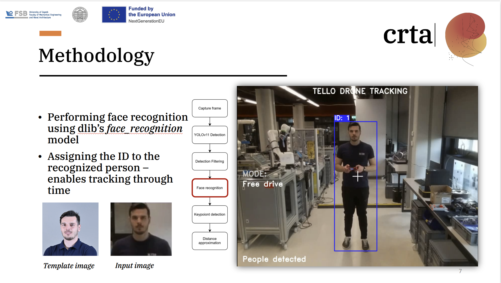

# Autonomous Quadcopter Navigation for Search and Rescue Missions Using Computer Vision and Convolutional Neural Networks

In this paper, we present a system using quadcopters for search and rescue missions, focusing on people detection, face recognition and tracking of identified individuals. The proposed solution integrates a DJI Tello quadcop-ter with ROS2 framework, that utilizes multiple convolutional neural net-works (CNN) for search and rescue missions. System identification and PD controller deployment are performed for optimal autonomous quadcopter navigation. The ROS2 environment utilizes the YOLOv11 and YOLOv11-pose CNN for tracking purposes, and the dlib library’s CNN for face recog-nition. The system detects a specific individual, performs face recognition and starts tracking. If the individual is not yet known, the quadcopter opera-tor can manually locate the person, save their facial image and immediately initiate the tracking process. The tracking process relies on specific keypoints identified on the human body using the YOLOv11-pose CNN model. These keypoints are used to track a specific individual and maintain a safe dis-tance. To enhance accurate tracking, system identification is performed, based on measurement data from the quadcopter’s IMU. The identified sys-tem parameters are used to design PD controllers that utilize YOLOv11-pose to estimate the distance between the quadcopter’s camera and the identified individual. The initial experiments, conducted on 11 known individuals demonstrated that the proposed system can be successfully used in real time. The next step involves implementing the system on a large experimental drone for field use and integrating autonomous navigation with GPS-guided control.

## Awards
Best Application Paper Award: Finalist , 34th International Conference on Robotics in Alpe-Adria-Danube Region, RAAD2025, Belgrade, Serbia

## Overview
This paper presents:
- Authonomous Search and Rescue system using UAVs
- People detection, face recognition and body tracking using deep learining algorithms.
- Data-driven system identification and PD controller design.

## Project components
Main project components:
- People detection using [YOLOv11s](https://docs.ultralytics.com/models/yolo11/) convolutional neural network
- Face detection, face embedding vector calculation and face recognition using [dlib's](http://dlib.net/) face recognition convolutional neural network
- Body keypoints detection using YOLOv11-pose novoluutional neural network
- Data-driven system identification and PD controller design using [Matlab](https://www.mathworks.com/products/matlab.html) and [Simulink](https://www.mathworks.com/products/simulink.html)
- DJI Tello drone ROS2 integration using [tello_driver](https://wiki.ros.org/tello_driver)

## Video
 [Autonomous Quadcopter Navigation for SAR Missions Using Computer Vision and CNNs 01](https://youtu.be/8VNuQz0snF0)
 
 [Autonomous Quadcopter Navigation for SAR Missions Using Computer Vision and CNNs 02](https://youtu.be/Y3YpWdQgRvw)

## Code Implementation

To implement the provided ROS2 package:
- Install ROS2 Humble [Humble](https://docs.ros.org/en/humble/Installation.html)
- Setup ROS2 [Workspace](https://docs.ros.org/en/humble/Tutorials/Beginner-Client-Libraries/Creating-A-Workspace/Creating-A-Workspace.html)
- Setup "drone_search" package, [tutorial](https://docs.ros.org/en/humble/Tutorials/Beginner-Client-Libraries/Creating-Your-First-ROS2-Package.html)
- Setup additional packages, [vision_opencv](https://github.com/ros-perception/vision_opencv) , [tello_ros](https://github.com/clydemcqueen/tello_ros)
- Build, Source and Run

##  Presentation

